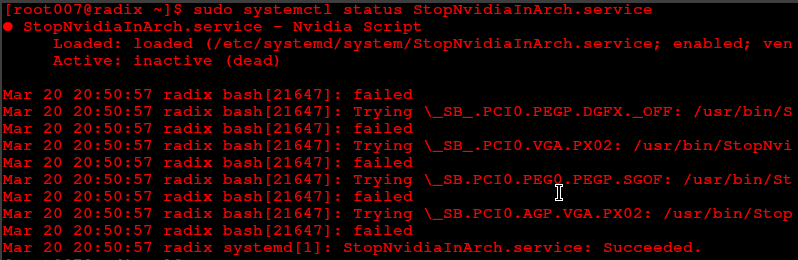

# Stop Nvidia In Arch And Manjaro

## For Discrete Nvidia GPU ::

- **This is for when you want to stop Nvidia GPU in your Arch/Manjaro Linux completely**

- I am using Dell G3 3579(Nvidia Geforce GTX 1050)

- This method will increase the battery's performance.
- Also, any lag and bootup issues will be fixed after doing this.
- This guide will help you automate Arch Linux's wiki script.
- You can download the same bash script from [the Arch Wiki.](https://wiki.archlinux.org/index.php/Hybrid_graphics#Fully_Power_Down_Discrete_GPU "arch wiki")
- **You can use either of the methods. The recommended one is DisableNvidia.sh.**

### Steps if you want to use DisableNvidia.sh ::

- After cloning, go to the downloaded folder. Open a terminal there.
- Enter the following in the terminal ::

```
 chmod +x DisableNvidia.sh
```

- To run the script, enter this ::

```
  ./DisableNvidia.sh
```

- You will be asked to enter your password and once you enter it your Nvidia GPU will be disabled permanently .
- You should see something like [this](images/systemctlstatus.png) .

### Steps if you don't want to use DisableNvidia.sh ::

- After cloning the files, copy the **StopNvidiaInArch.sh** to /usr/bin/
- Now make this file executable
- To Make any file executable just do this **chmod +x filename**. In this case ::

```
  chmod +x StopNvidiaInArch.sh
```

- Now we have to create and enable systemd service
- To do this just copy the file you have downloaded(Name of the file **StopNvidiaInArch.service**) to the directory /etc/systemd/system/

- Now you just have to enable the service on startup. To do that just enter the following commands ::

```
sudo systemctl enable StopNvidiaInArch.service
```

- Output for the above command will be :

```
Created symlink /etc/systemd/system/multi-user.target.wants/StopNvidiaInArch.service → /etc/systemd/system/StopNvidiaInArch.service.
```

- To start it right now

```
sudo systemctl start StopNvidiaInArch.service
```

- To check the status of the service

```
sudo systemctl status StopNvidiaInArch.service
```

- **Output Of status**
  

## Reference List

- https://wiki.archlinux.org/index.php/Hybrid_graphics#Fully_Power_Down_Discrete_GPU
- https://wiki.archlinux.org/index.php/NVIDIA_Optimus
- https://wiki.archlinux.org/index.php/Systemd
- https://raw.githubusercontent.com/mkottman/acpi_call/master/examples/turn_off_gpu.sh

# Contributing ::

Please check out the [contributing.md](Contributing.md) guide on how you can actively participate in the development of this project.

# License 

This project is licensed under the GNU General Public License v3.0 - see the [License.md](https://github.com/radix007/ StopNvidiaInArch/blob/master/LICENSE) file for more details.
